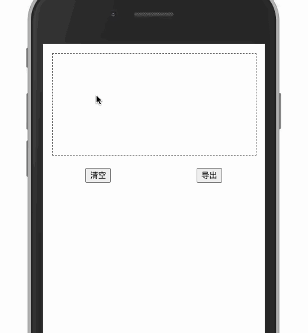

# 手写签名

支持清空 canvas

导出使用`canvas.toBlob`上传即可

如需图片展示则使用`canvas.toDataURL`即可

-   canvas.utils
    | 方法 | 描述 |
    | ---- | ---- |
    | clearCanvas(context: CanvasRenderingContext2D) | 清空 canvas |
    | isCanvasBlank(canvas: HTMLCanvasElement) | canvas 是否为空 |
    | useCanvasPainting(canvas: HTMLCanvasElement): { context: CanvasRenderingContext2D } | 创建画布并返回 context |
-   demo
    
